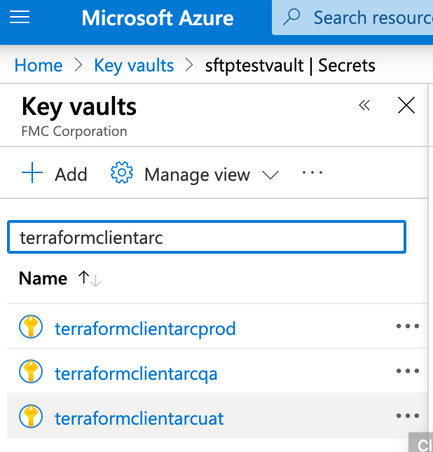
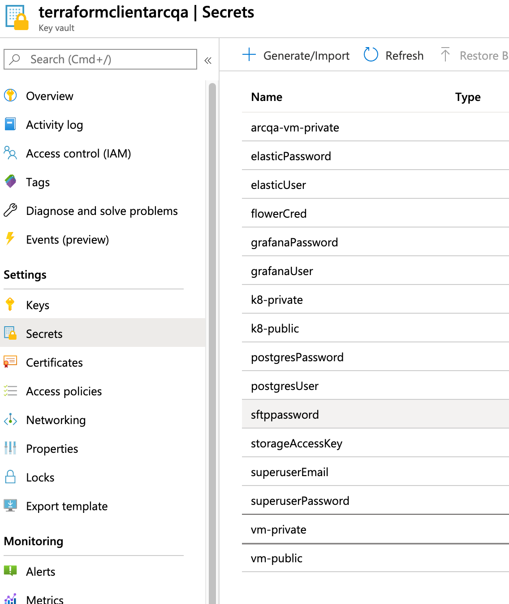

# Keys

Running this terraform to create a new environment will create a new keyvault with all the randomly generated passwords.



Take a look at the individual secrets in a keyvault:



Two in particular are important:

- vm-private + vm-public
- k8-private + k8-public

these contain the public/private ssh key pairs for accessing the bastion machines in their respective environments.
to use them:

1. Save the private vm key to ~/.ssh/arcqa-vm.private.pem
2. Save the public vm key to ~/.ssh/arcqa-vm.public.pem
3. Set the permissions correctly for the keys so they're protected:
```
chmod 600 *.pem
```
4. Find the ip address of the bastion vm for your environment. Ask for help if you don't have access to the azure portal.
5. create an ssh config file in ~/.ssh/config
```
Host arcqa-bastion
 HostName 40.79.25.160
 User ubuntu
 IdentityFile ~/.ssh/arcqa-vm.private.pem
```
5. now you can connect to the bastion
```
ssh arcqa-bastion
```
