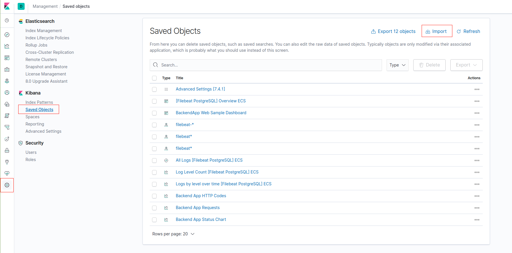

# Post-deployment instruction

Includes steps which may be run after environment deployment is done.

## Import Kibana dashboards

Kibana allows importing saved dashboards and visualizations through the web interface available through `Management -> Saved Objects -> Import` dialog.

Press `Import` and upload `.ndjson` files from [kibana-resources/](https://bitbucket.org/fmcdevops/fmc-devops/src/master/kibana-resources/) directory one by one.

